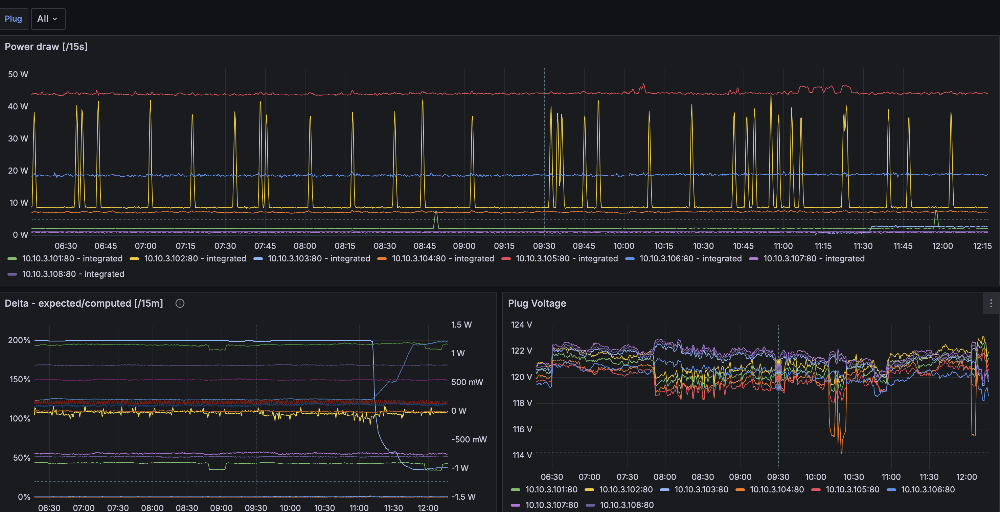

# Sonoff S31

The Sonoff S31 is a smart plug with energy monitoring capabilities. It is based on the ESP8266 and can be reprogrammed to work with Home Assistant via [ESPHome](https://esphome.io/).

## Features

- Power monitoring
- Total energy monitoring
- Current monitoring
- Voltage monitoring
- Remote control
- [Prometheus metrics](#prometheus)

## Flashing

To flash the Sonoff S31 the first time, you will need to open the case and connect a USB-to-serial adapter to the pins on the PCB. A good guide to follow is [this one](https://alfter.us/2021/12/12/using-the-sonoff-s31-with-esphome-first-time-flash/). For subsequent flashes, you can use OTA updates.

When flashing, I use the `example.yaml` file in this repository as a starting point. You will need to change the name values in the `substitutions` section to match your desired names. Using a `secrets.yaml` file is recommended for the Wi-Fi SSID and password.

## Prometheus

This config file is designed to expose the S31 metrics to Prometheus. To use this feature, you will need to add the following to your `prometheus.yml` configuration file:

```yaml
# minimal configuration
- job_name: powermon_esphome
  scheme: http
  static_configs:
  - targets:
    - "<IP for Sonoff S31 Plug>"
```

However, it is **highly** recommended to refer to the `prometheus_config.yaml` file in this repository for a more advanced configuration. This more advanced configuration includes metric relabeling and metric renaming to make the metrics better follow Prometheus best practices by renaming the generic `esphome_sensor_value{id="..."}` to `esphome_sensor_...{}` as well as dropping the `..._failed` metrics that are not useful.

### Monitoring

If you do use the `prometheus_config.yaml` file, you can additionally import the `grafana_dashboard.json` file into Grafana to get a pre-built dashboard for monitoring the Sonoff S31.


